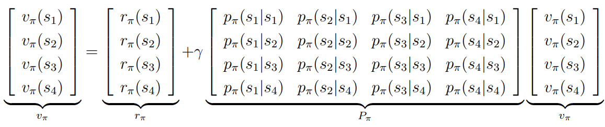
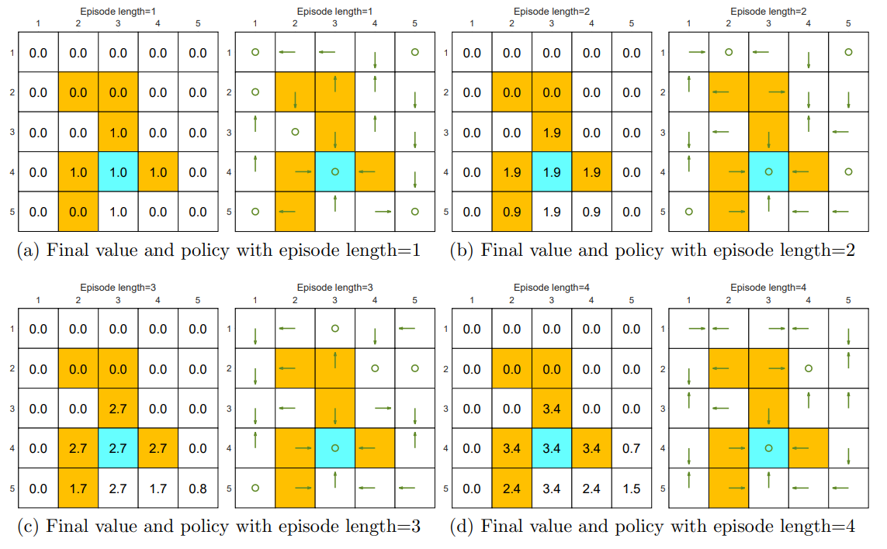
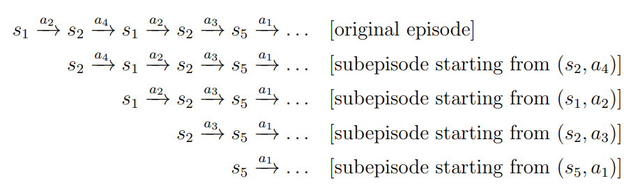

# LLM

# RL

强化学习的目标是**求解最优策略**

## basic concept

**State**：环境给agent的信息

**Action**：agent在某个状态下可以执行的决策

**Policy**: agent在某个状态下选择动作的原则，$$\pi\left(a_{2}\mid s_{1}\right)=1$$表示在s1的状态下采取动作a2的概率为1	

**reward**：$$p\left(r=-1 \mid s_{1}, a_{1}\right)=1$$在状态s1和a1下得到分数-1的概率为1

**Trajectory**：state-action-reward链 $$ S_1 \xrightarrow[\,r=0\,]{a_2} S_2 \xrightarrow[\,r=0\,]{a_3} S_5 \xrightarrow[\,r=0\,]{a_3} S_8 \xrightarrow[\,r=1\,]{a_2} S_9. $$ 该链上的reward之和为return，return可用于评估policy；存在Terminal state的Trajectory称为eposide

**Discounted reward**：$$G_t = r_t + \gamma r_{t+1} + \gamma^2 r_{t+2} + \cdots$$，用于解决无限发散的序列，γ是折扣因子在[0,1)，越小则关心当前奖励，越大关心未来奖励

**MDP**（Markov Decision Process,马尔可夫决策过程)：描述智能体如何在环境中连续做决策的框架；Markov Property指$$P(s_{t+1} \mid s_t) = P(s_{t+1} \mid s_0, \dots, s_t)$$未来只与当前状态有关，与更早的历史无关。

## 贝尔曼公式

State value，$$v_\pi(s) \doteq \mathbb{E}\left[G_t \mid S_t = s\right]$$ 在策略π下，从状态s出发能够获得的期望长期回报，当$\pi$固定时为**policy evaluation**

贝尔曼公式描述了当前状态的state value=当前奖励 + 下一状态的state value
$$
\begin{aligned} G_t &= R_{t+1} + \gamma R_{t+2} + \gamma^2 R_{t+3} + \dots \\ &= R_{t+1} + \gamma\left(R_{t+2} + \gamma R_{t+3} + \dots\right) \\ &= R_{t+1} + \gamma G_{t+1}, 
\\
v_\pi(s) &\equiv \mathbb{E}\left[G_t \mid S_t = s\right] \\
&= \mathbb{E}\left[R_{t+1} + \gamma G_{t+1} \mid S_t = s\right] \\
&= \mathbb{E}\left[R_{t+1} \mid S_t = s\right] + \gamma \mathbb{E}\left[G_{t+1} \mid S_t = s\right].

\end{aligned}
$$

$$

$$

$$
\begin{aligned}
\mathbb{E}\left[R_{t+1} \mid S_t = s\right] &= \sum_{a \in \mathcal{A}} \pi(a \mid s)\,\mathbb{E}\left[R_{t+1} \mid S_t = s,\,A_t = a\right] \\
&= \sum_{a \in \mathcal{A}} \pi(a \mid s) \sum_{r \in \mathcal{R}} p(r \mid s,a)\,r.
\\
\mathbb{E}\left[G_{t+1} \mid S_t = s\right] &= \sum_{s' \in \mathcal{S}} \mathbb{E}\left[G_{t+1} \mid S_t = s,\,S_{t+1} = s'\right]p(s' \mid s) \\ &= \sum_{s' \in \mathcal{S}} \mathbb{E}\left[G_{t+1} \mid S_{t+1} = s'\right]p(s' \mid s) \quad (\text{due to the Markov property}) \\ &= \sum_{s' \in \mathcal{S}} v_\pi(s')\,p(s' \mid s) \\ &= \sum_{s' \in \mathcal{S}} v_\pi(s') \sum_{a \in \mathcal{A}} p(s' \mid s,a)\,\pi(a \mid s).
\\

\end{aligned}
$$

$$
 \begin{aligned} v_\pi(s) &= \mathbb{E}\left[R_{t+1} \mid S_t = s\right] + \gamma \mathbb{E}\left[G_{t+1} \mid S_t = s\right], \\ &= \underbrace{\sum_{a \in \mathcal{A}} \pi(a \mid s) \sum_{r \in \mathcal{R}} p(r \mid s,a)\,r}_{\text{mean of immediate rewards}} + \gamma \underbrace{\sum_{a \in \mathcal{A}} \pi(a \mid s) \sum_{s' \in \mathcal{S}} p(s' \mid s,a)\,v_\pi(s')}_{\text{mean of future rewards}} \\ &= \sum_{a \in \mathcal{A}} \pi(a \mid s) \left[ \sum_{r \in \mathcal{R}} p(r \mid s,a)\,r + \gamma \sum_{s' \in \mathcal{S}} p(s' \mid s,a)\,v_\pi(s') \right], \quad \text{for all } s \in \mathcal{S}. \end{aligned} 
$$

从矩阵的角度求解，定义
$$
\begin{aligned}
\\r_\pi(s) &\doteq \sum_{a \in \mathcal{A}} \pi(a \mid s) \sum_{r \in \mathcal{R}} p(r \mid s,a)\,r, 
\\p_\pi(s' \mid s) &\doteq \sum_{a \in \mathcal{A}} \pi(a \mid s)\,p(s' \mid s,a)
\\
\end{aligned}
$$
前者是从状态s出发得到的immediate reward ，后者是从s出发到达其他状态的概率
$$
v_\pi(s_i) = r_\pi(s_i) + \gamma \sum_{s_j \in \mathcal{S}} p_\pi(s_j \mid s_i)\,v_\pi(s_j)
$$
公式对所有的状态都成立，那么有

该式子可以通过**求逆**解决，**$$v_\pi = \left(I - \gamma P_\pi\right)^{-1} r_\pi$$**，但是当状态数较大时计算开销会增长较快

另一种方式是**迭代**，**$$v_{k+1} = r_\pi + \gamma P_\pi v_k,\quad k=0,1,2,\dots$$，**当k趋于无穷时，结果也就趋于求逆的结果

action value，$$q_\pi(s,a) = \mathbb{E}\left[G_t \mid S_t = s,\ A_t = a\right]$$，从状态s出发采取行动a能得到的长期回报。**在每个状态下选择最大的action value 不断迭代，一定能得到最优策略。**

与state value相关联$$v_\pi(s) = \sum_{a} \pi(a|s) q_\pi(s,a)$$，同时可以推出$$q_\pi(s,a) = \sum_{r\in\mathcal{R}} p(r|s,a)r + \gamma \sum_{s'\in\mathcal{S}} p(s'|s,a)v_\pi(s')$$

## 贝尔曼最优公式

**state value可以衡量一个策略的好坏，当$$v_{\pi_1}(s) \ge v_{\pi_2}(s),\quad \text{for all } s\in\mathcal{S}$$，状态$\pi_1$更好**

**贝尔曼最优公式**是贝尔曼公式的一个特例，把求解最优策略的问题转换为求解最优state value的问题
$$
\begin{aligned} v(s) &= \max_{\pi(s)\in\Pi(s)} \sum_{a\in\mathcal{A}} \pi(a|s) \left( \sum_{r\in\mathcal{R}} p(r|s,a)r + \gamma \sum_{s'\in\mathcal{S}} p(s'|s,a)v(s') \right) \\ &= \max_{\pi(s)\in\Pi(s)} \sum_{a\in\mathcal{A}} \pi(a|s)q(s,a) \\&= f(v)= \max_{\pi\in\Pi}\big(r_\pi + \gamma P_\pi v\big)
\end{aligned}
$$
**Contraction mapping theorem，对于满足$$\left\| f(x_1) - f(x_2) \right\| \le \gamma \left\| x_1 - x_2 \right\|$$一定存在不动点$f(x^*)=x^*$,且$x^*$唯一，通过迭代$$x_{k+1} = f(x_k)$$一定能收敛到$x^*$**

## value iteration&policy iteration

### value iteration

**值迭代**初始随机一个$v_k$，基于**Contraction mapping theorem**的性质求解贝尔曼最优公式

值迭代可以拆解为

**Policy Update**，对于当前的$v_k$寻找最好的策略
$$
\pi_{k+1} = \underset{\pi}{\arg\max}\left(r^{\pi} + \gamma P^{\pi} v_k\right) \\
a^* = \underset{a}{\arg\max} Q_k(s,a)
\\
\pi_{k+1}(a|s)=
\begin{cases}
1, & a=a_k^*(s)\\
0, & a\neq a_k^*(s) & greedy 
\end{cases}
$$

**value update**	
$$
v_{k+1}(s) = \sum_{a}\pi_{k+1}(a|s)\underbrace{\left(\sum_{r}p(r|s,a)r+\gamma\sum_{s'}p(s'|s,a)v_{k}(s')\right)}_{q_{k}(s,a)}
\\
v_{k+1}(s) = \max_{a} q_{k}(s,a)
$$
当|$v_k-v_{k+1}$|差距很小时停止迭代

### policy iteration

初始随机一个策略$\pi_k$	

策略迭代可以拆解为

**policy evaluation**，求解state value 

$$
v_{\pi_k} = r_{\pi_k} + \gamma P_{\pi_k} v_{\pi_k}
$$

**policy improvement**
$$
\pi_{k+1} = \underset{\pi}{\arg\max}\left(r_{\pi} + \gamma P_{\pi} v_{\pi_k}\right)
\\
\pi_{k+1}(s) = \underset{\pi}{\arg\max} \sum_{a} \pi(a|s) \underbrace{\left( \sum_{r} p(r|s,a) r + \gamma \sum_{s'} p(s'|s,a) v_{\pi_k}(s') \right)}_{q_{\pi_k}(s,a)}
\\
a_k^{*}(s) = \underset{a}{\arg\max}\, q_{\pi_k}(a,s)
\\
\pi_{k+1}(a|s)=
\begin{cases}
1, & a=a_k^*(s),\\
0, & a\neq a_k^*(s).
\end{cases}
$$

### Truncated policy iteration

policy iteration和value iteration是Truncated policy iteration的两个特例，前者进行无穷次迭代精准求解$v_{\pi_k}$，后者只做一次bellman最优更新

Truncated policy iteration只做**m次 Bellman 期望更新**，不求精准的$v_{\pi_k}$，当m=1时为value iteration，m趋于无穷时policy iteration

## Monte Carlo Methods

蒙特卡洛方法是model-free，即不需要知道环境的状态转移概率和奖励函数（但是可以观察得到每一步的实际奖励）

Monte Carlo Estimation（蒙特卡洛估计），在不知道环境模型和奖励函数的情况下，通过采样得到真实轨迹的回报来估计价值函数的方法

### MC Basic

MC Basic是Policy iteration的变种，在policy evaluation中，通过**Monte Carlo Estimation**对所有的(s,a)求解**Q(s,a)**，即从(s,a)出发经过n次实验得到回报$g_{\pi_k}^{i}(s,a)$，最终有$$q^{\pi_k}(s,a) = \mathbb{E}\left[G_t \mid S_t = s, A_t = a\right] \approx \frac{1}{n}\sum_{i=1}^{n}g_{\pi_k}^{(i)}(s,a)$$，随后进行policy improvement

进行Monte Carlo Estimation时，不同的episode长度对策略有不同的影响，episode越长，估计的optimal state value越接近真值，策略越好。

### MC Exploring Starts

MC basic的效率较低，一个 episode 只更新起始的(s,a)，只有手机了大量的episode后才会更新策略

MC Exploring Starts是前者的改进，**二者的区别在于对样本的利用不同**，**一个 episode 更新沿途访问到的所有(s,a)，并且每个 episode 后就可以改进策略，因此样本利用率和学习效率更高。**在episode中，如果(s,a)出现了多次，first visit会只保留第一次出现得到的reward更新，every visit会对每一次取平均

Exploring Starts要求每个 episode 从随机随机的 (s,a) **开始**，注意这里不是更新，那么N(s,a)→∞，MC basic也要求Exploring Starts

### MC ε-greedy

现实中做不到Exploring Starts，很多场景无法任意指定起始状态

ε-greedy 的思想是：**大部分时间选择当前最有动作，少部分时间随机探索**
$$
\pi(a|s)= \begin{cases} \displaystyle 1-\frac{\epsilon}{|\mathcal{A}(s)|}\big(|\mathcal{A}(s)|-1\big), & \text{for the greedy action},\\[6pt] \displaystyle \frac{\epsilon}{|\mathcal{A}(s)|}, & \text{for the other } |\mathcal{A}(s)|-1 \text{ actions}, \end{cases}
$$
$|\mathcal{A}(s)|$ 是状态数，ε ∈ [0, 1]，ε为0时，ε-greedy就是greedy，ε为1时，变为随即探索

MC ε-greedy与MC Exploring Starts相似，在policy improvement时有区别
$$
\pi_{k+1}(s)=\arg\max_{\pi\in\Pi_\epsilon}\sum_{a}\pi(a|s)q_{\pi_k}(s,a)

\\

\pi_{k+1}(a|s)=
\begin{cases}
\displaystyle 1-\frac{|\mathcal{A}(s)|-1}{|\mathcal{A}(s)|}\epsilon, & a=a_k^*,\\[6pt]
\displaystyle \frac{1}{|\mathcal{A}(s)|}\epsilon, & a\neq a_k^*,
\end{cases}
$$

## Stochastic Approximation
