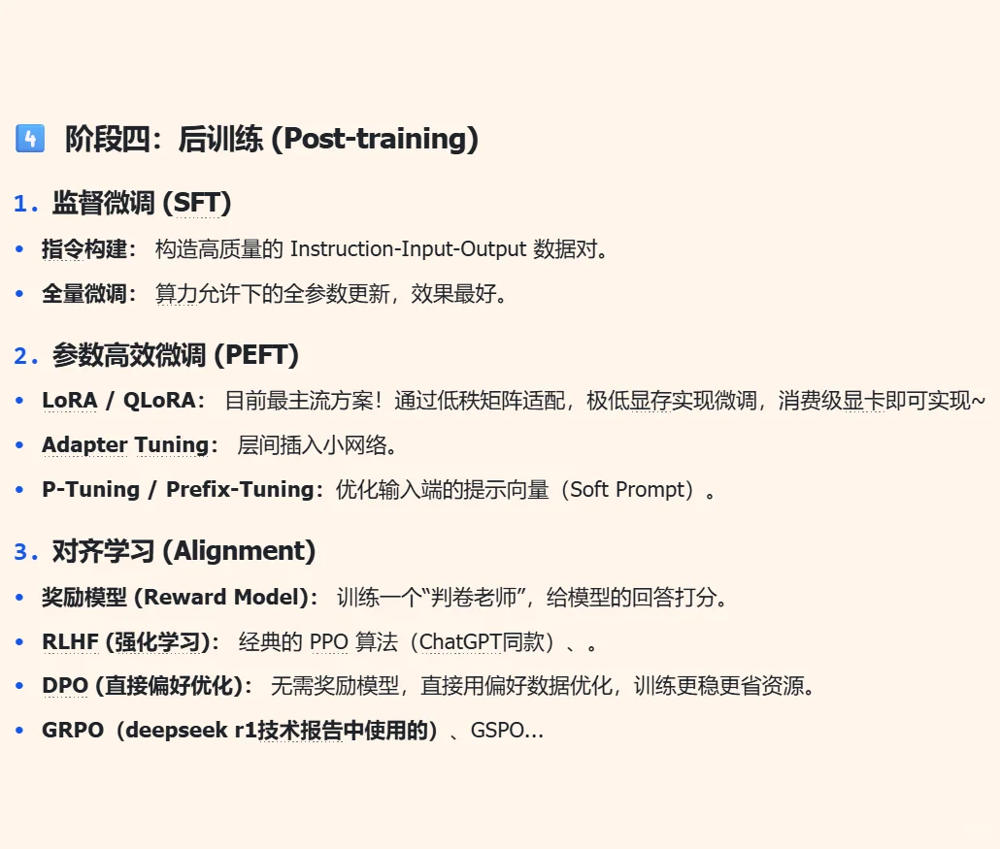
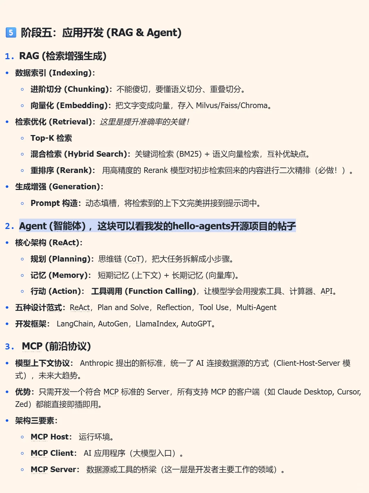
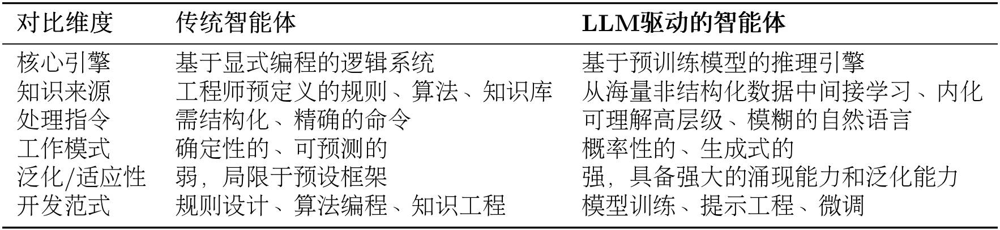
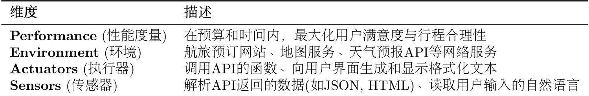
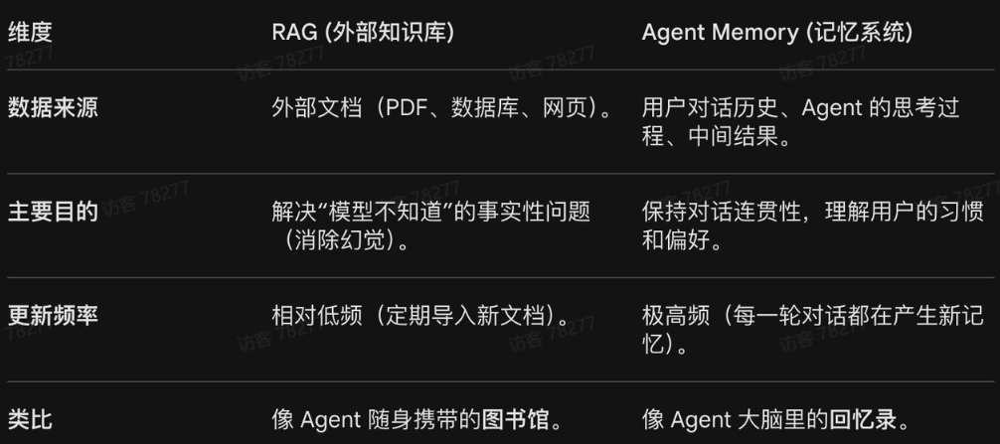
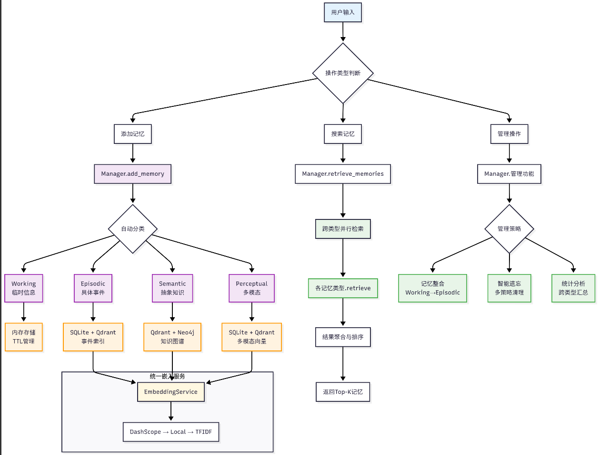
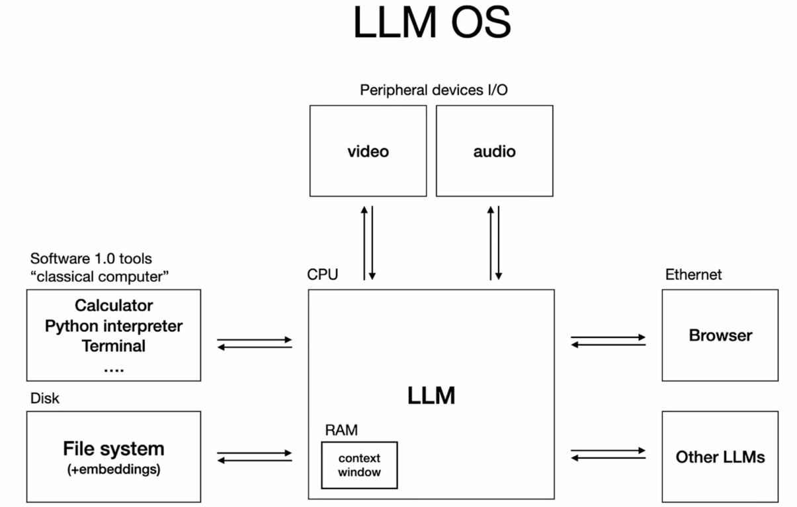
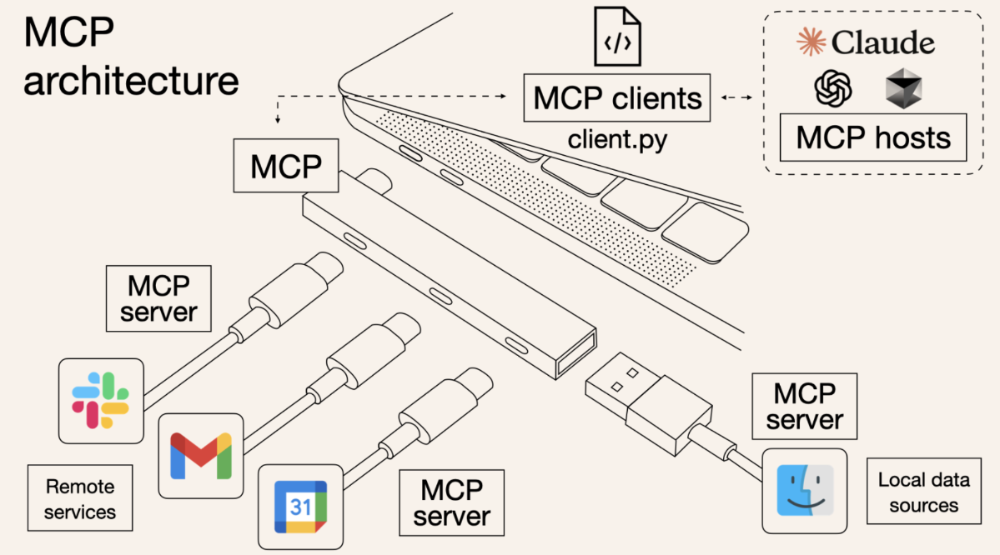
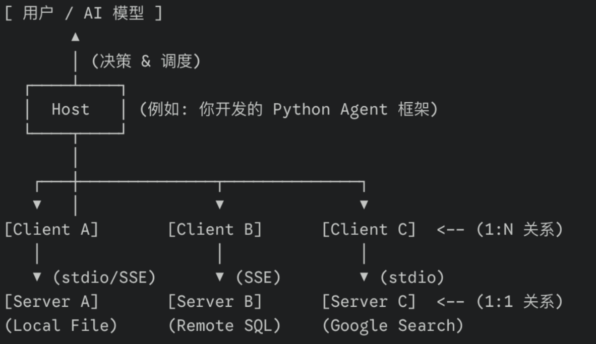

# LLM

## 名词

+ Language model 语言模型，在参数增加的过程中，语言模型涌现出了智能，为了加以区分使用Large，构成LLM

+ context，上下文，一般指代提问中的背景信息
+ memory，对话的历史记录
+ RAG，检索增强生成，通过语言匹配向量化信息，并加入上下文
+ function callling，agent与LLM关于工具调用约定的对话格式
+ MCP，模型上下文协议，让智能体以统一的方式连接外部工具、数据源和服务，这样一个工具只需开发一次就可以适配所有支持MCP的框架
+ Skill，agent的技能，一份结构化的能力说明文件，告诉agent什么场景触发，什么步骤执行，失败了怎么办，是可复用的能力模块


**🔬 算法工程师路径**：

- Agent 推理与规划：ReAct、Reflexion、Tree/Graph Search、Tool-use 策略
- RAG 与记忆算法：Hybrid Retrieval、Rerank、GraphRAG、Agentic RAG、Memory 压缩与召回
- Post-training：SFT、LoRA/QLoRA、DPO/GRPO、工具调用/轨迹数据合成与评测

**🛠️ 开发工程师路径**：

- Agent Harness：状态管理、工具注册、权限确认、sandbox、trace、replay、成本控制
- 工具与协议：MCP、Skills、A2A/ACP、API adapter、Browser / Computer-use 工具封装
- 生产级 RAG：文档解析、向量库、rerank、引用、观测、CI eval 与安全红队


# Agent






## basic

### 智能体定义

智能体被定义为任何能够通过**传感器（Sensors）**感知其所处**环境（Environment）**，并**自主**地通过**执行器（Actuators）**采取**行动（Action）**以达成特定目标的实体。


由大语言模型驱动的 LLM 智能体，其核心决策机制与传统智能体存在本质区别；**传统智能体的能力源于工程师的显式编程与知识构建，其行为模式是确定且有边界的；而 LLM 智能体则通过在海量数据上的预训练，获得了隐式的世界模型与强大的涌现能力，使其能够以更灵活、更通用的方式应对复杂任务。**



因此，LLM 智能体可以直接处理**高层级、模糊且充满上下文信息**的自然语言指令


智能体的任务环境通常使用PEAS描述，以智能旅行助手为例	




Agent的八个组成部分

| 模块            | 作用                     | 面试追问                     |
| :-------------- | :----------------------- | :--------------------------- |
| Goal            | 定义任务和成功标准       | 怎么判断任务完成？           |
| Policy          | 系统规则、安全边界、权限 | 哪些动作必须人工确认？       |
| State           | 当前进度、历史、临时产物 | 长任务如何恢复？             |
| Memory          | 可复用经验和用户偏好     | 什么值得存，什么时候忘？     |
| Context Builder | 组装模型输入             | 如何避免上下文污染？         |
| Tool Registry   | 声明可调用工具           | schema、错误、权限怎么设计？ |
| Loop Controller | 决定下一步和停止条件     | 如何防止无限循环？           |
| Eval / Trace    | 记录和评估行为           | 如何证明 Agent 有效？        |


### decoder-only架构

生成任务本质上是在一个已有的文本序列后面，一个词一个词地添加内容，基于这个思想GPT抛弃了编码器，只保留解码器


Decoder-Only 架构的工作模式被称为**自回归 (Autoregressive)**

1. 给模型一个起始文本（例如 “Datawhale Agent is”）。
2. 模型预测出下一个最有可能的词（例如 “a”）。
3. 模型将自己刚刚生成的词 “a” 添加到输入文本的末尾，形成新的输入（“Datawhale Agent is a”）。
4. 模型基于这个新输入，再次预测下一个词（例如 “powerful”）。
5. 不断重复这个过程，直到生成完整的句子或达到停止条件。


**Decoder-Only 架构的优势**

- **训练目标统一**：模型的唯一任务就是“预测下一个词”，这个简单的目标非常适合在海量的无标注文本数据上进行预训练。
- **结构简单，易于扩展**：更少的组件意味着更容易进行规模化扩展。今天的 GPT-4、Llama 等拥有数千亿甚至万亿参数的巨型模型，都是基于这种简洁的架构。
- **天然适合生成任务**：其自回归的工作模式与所有生成式任务（对话、写作、代码生成等）完美契合，这也是它能成为构建通用智能体基础的核心原因。


### BPE分词算法

古典分词算法（按空格划分，符号划分...）会导致词表规模过大，出现**Out Of Vocabulary, OOV**问题；按照单个字符的划分方法，序列太长。


BPE（Byte Pair Encoding，字节对编码），是一种字词分词算法，核心思想是：从最小的单位开始，**不断合并出现频率最高的相邻符号对**。


以下述语料为例

```
low
lower
newest
widest
```

先拆分为字符，再加结束符，结束符可以防止出现lowe，因为low <w>的频率约束

```
l o w </w>
l o w e r </w>
n e w e s t </w>
w i d e s t </w>
```

初始词表为

```
l
o
w
e
r
n
s
t
i
d
</w>
```


统计所有相邻符号对，出现最多的是<l,o>，合并lo，语料变为

```
lo w </w>
lo w e r </w>
n e w e s t </w>
w i d e s t </w>
```

词表中新增lo


再次统计频率，(lo,w)最高，继续合并

```
low </w>
low e r </w>
n e w e s t </w>
w i d e s t </w>
```

词表新增low


不断迭代，最终得到词表和合并规则


推理时，先拆分字符再按照合并规则得到一个词对应的sub token 

```
[lower]

l o w e r

l o -> lo
lo w -> low
e r -> er

[low, er]
```


### 与模型交互

**模型采样参数**Temperature，通过调整模型对 “概率分布” 的采样策略，也就是$$ \text{将 Softmax 改写为 } p_i^{(T)} = \frac{e^{z_i/T}}{\sum_{j=1}^k e^{z_j/T}} $$，让输出匹配具体场景需求

- 低温度（0 ⩽ Temperature < 0.3）时输出更 “精准、确定”。适用场景： 事实性任务：如问答、数据计算、代码生成； 严谨性场景：法律条文解读、技术文档撰写、学术概念解释等场景。
- 中温度（0.3 ⩽ Temperature < 0.7）：输出 “平衡、自然”。适用场景： 日常对话：如客服交互、聊天机器人； 常规创作：如邮件撰写、产品文案、简单故事创作。
- 高温度（0.7 ⩽ Temperature < 2）：输出 “创新、发散”。适用场景： 创意性任务：如诗歌创作、科幻故事构思、广告 slogan brainstorm、艺术灵感启发； 发散性思考。


根据给模型提供示例（Exemplar）的数量，提示可以分为三种类型


**零样本提示** 不给任何实例

```Python
文本:Datawhale的AI Agent课程非常棒！
情感:正面
```


**单样本提示** 给模型提供一个完整的示例，向它展示任务的格式和期望的输出风格

```Python
文本:这家餐厅的服务太慢了。
情感:负面

文本:Datawhale的AI Agent课程非常棒！
情感:
```


**少样本提示** 提供多个示例，这能让模型更准确地理解任务的细节、边界和细微差别，从而获得更好的性能

```Python
文本:这家餐厅的服务太慢了。
情感:负面

文本:这部电影的情节很平淡。
情感:中性

文本:Datawhale的AI Agent课程非常棒！
情感:
```


**指令调优** 是一种微调技术，它使用大量“指令-回答”格式的数据对预训练模型进行进一步的训练，极大地简化了与模型交互的方式，使得直接、清晰的自然语言指令成为可能


**思维链 (Chain-of-Thought, CoT)** 是一种强大的提示技巧，它通过引导模型“一步一步地思考”，提升了模型在复杂任务上的推理能力。实现 CoT 的关键，是在提示中加入一句**简单的引导语**，如“请逐步思考”或“Let's think step by step”。对于需要逻辑推理、计算或多步骤思考的复杂问题非常重要。


### 缩放定律

**缩放法则（Scaling Laws）**，模型性能与模型参数量、训练数据量以及计算资源之间存在着可预测的幂律关系，只要持续、按比例地增加这三个要素，模型的性能就会可预测地、平滑地提升，而不会出现明显的瓶颈。

**Chinchilla 定律**，在给定的预算下，为了达到最优性能，**模型参数量和训练数据量之间存在一个最优配比**


缩放定律带来的最惊奇地产物是”能力的涌现“，**链式思考 (Chain-of-Thought)** 、**指令遵循 (Instruction Following)** 、多步推理、代码生成等能力，都是在模型参数量达到数百亿甚至千亿级别后才显著出现的，这说明模型在学习的过程中可能形成了某种更深层次的抽象和推理能力。


### 模型幻觉

**模型幻觉**指大预言模型生成了不存在的事实、实体或事件，幻觉的产生是多方面因素共同作用的结果，首先，训练数据中可能包含错误或矛盾的信息。其次，模型的自回归生成机制决定了它只是在预测下一个最可能的词元，而没有内置的事实核查模块。最后，在面对需要复杂推理的任务时，模型可能会在逻辑链条中出错，从而“编造”出错误的结论


1. **数据层面**： 通过高质量数据清洗、引入事实性知识以及强化学习与人类反馈 (RLHF) 等方式，从源头减少幻觉。
2. **模型层面**： 探索新的模型架构，或让模型能够表达其对生成内容的不确定性。
3. 推理与生成层面
   1. **检索增强生成 (Retrieval-Augmented Generation, RAG)**： 这是目前缓解幻觉的有效方法之一。系统通过在生成之前从外部知识库（如文档数据库、网页）中检索相关信息，然后将检索到的信息作为上下文，引导模型生成基于事实的回答。
   2. **多步推理与验证**： 引导模型进行多步推理，并在每一步进行自我检查或外部验证。
   3. **引入外部工具**： 允许模型调用外部工具（如搜索引擎、计算器、代码解释器）来获取实时信息或进行精确计算。

## 智能体范式

### ReAct框架

> ReAct = Reasoning + Acting，它让模型在推理和行动之间交替：先判断下一步，再调用工具，再根据观察结果继续。每一步都是思考-动作-观察的循环


下述是一个简单的例子

用户提问：

```
马斯克创办了哪些公司？
```

Agent执行过程：

```
Thought:
需要先查马斯克的信息

Action:
Search("Elon Musk companies")

Observation:
Tesla, SpaceX, xAI ...

Thought:
已经获得结果，可以整理答案

Final Answer:
...
```


Prompt 结构

```python
You are an agent that solves the task by calling tools.

Rules:
- Use only the listed tools.
- Stop when enough evidence is collected.
- If evidence is missing, say what is missing.
- Never fabricate tool results.

Task:
{task}

Tools:
{tool_cards}

Previous observations:
{observations}

Return JSON:
{
  "type": "tool_call | final",
  "tool": "tool name or null",
  "args": {},
  "answer": "final answer or null",
  "reason_summary": "short auditable reason"
}
```


Tool Card

ReAct的失败常常不是模型不会推理，而是工具描述太差，工具的描述需要写清楚

```markdown
## Tool: search_papers

**Purpose**：按关键词搜索论文元数据，返回标题、摘要、作者、年份、链接和引用信息。

**Use When**：
- 用户需要查找某个主题的代表论文。
- Agent 需要为答案补充可引用证据。
- 需要比较不同方法的提出时间和核心贡献。

**Do Not Use When**：
- 用户已经给了具体 PDF，并要求只基于该 PDF 回答。
- 问题需要网页实时信息而不是学术论文。

**Input Schema**：
```json
{
  "query": "string, required",
  "year_from": "integer, optional",
  "year_to": "integer, optional",
  "max_results": "integer, default 5, max 20"
}
```

**Output Schema**：

```json
{
  "ok": true,
  "items": [
    {
      "title": "string",
      "authors": ["string"],
      "year": 2025,
      "abstract": "string, truncated to 800 chars",
      "url": "string",
      "source": "arXiv | Semantic Scholar | OpenAlex"
    }
  ],
  "next_page_token": "string | null"
}
```

**Errors**：

| error                | retryable | Agent 应对                    |
| :------------------- | :-------: | :---------------------------- |
| `rate_limited`       |    yes    | 降低 `max_results` 或稍后重试 |
| `empty_result`       |    no     | 改写 query 或放宽年份         |
| `source_unavailable` |    yes    | 切换备用数据源                |

**Security**：

- 只访问公开论文元数据。
- 不抓取付费墙内容。
- 不把 API key 写入 trace。


常见失败模式

| 失败         | 现象                   | 修复                                |
| :----------- | :--------------------- | :---------------------------------- |
| 无限循环     | 一直搜索或重复点击     | 最大步数、重复动作检测              |
| 工具选择错   | 本该查数据库却搜网页   | 工具描述加 Use When / Do Not Use    |
| 观察过长     | 工具返回淹没关键信息   | 工具层分页、摘要、截断              |
| 过早 final   | 证据不足就回答         | evidence gate、引用检查             |
| 幻觉工具结果 | 没调用工具却声称查到了 | trace 强制引用 observation          |
| 高风险动作   | 自动付款、删除、提交   | permission tier + human-in-the-loop |

评测时至少记录：

+ 任务平均成功率
+ 平均步数
+ 工具调用成功率
+ 成本和延迟
+ 重复动作次数


### Plan and Slove

Plan and Slove是一种智能体范式，核心思想是：**与其让模型一步步思考，不如先让模型制定一个计划，然后按计划执行**。


Plan and Slove的运作机制分为两个核心阶段：

+ **第一阶段是计划生成，需要识别约束条件，子目标分解，逻辑排序**
+ **第二阶段是计划执行，每一个子步骤的计算结果会作为下一轮推理的上下文，这个过程中同时维护状态**


Plan and Slove的优劣

优势：可解释性强；支持复杂任务建模；能保证逻辑一致性；有效缓解COT中常见的推理漂移问题；

劣势：对模型的逻辑能力要求高；缺乏动态适应性；如果执行过程中环境发生了变化，静态计划无法自动调整；计划与执行可能断层


由于存在两个阶段，因此Plan and Slove有两个prompt

~~~python
PLANNER_PROMPT_TEMPLATE = """
你是一个顶级的AI规划专家。你的任务是将用户提出的复杂问题分解成一个由多个简单步骤组成的行动计划。 请确保计划中的每个步骤都是一个独立的、可执行的子任务，并且严格按照逻辑顺序排列。 你的输出必须是一个Python列表，其中每个元素都是一个描述子任务的字符串。 
问题: {question}
请严格按照以下格式输出你的计划,```python与```作为前后缀是必要的: 
```python 
["步骤1", "步骤2", "步骤3", ...] 
``` 
""" 
~~~

```python
EXECUTOR_PROMPT_TEMPLATE = """
你是一位顶级的AI执行专家。你的任务是严格按照给定的计划，一步步地解决问题。
你将收到原始问题、完整的计划、以及到目前为止已经完成的步骤和结果。
请你专注于解决“当前步骤”，并仅输出该步骤的最终答案，不要输出任何额外的解释或对话。
# 原始问题:
{question}

# 完整计划:
{plan}

# 历史步骤与结果:
{history}

# 当前步骤:
{current_step}

请仅输出针对“当前步骤”的回答:
"""
```


### Claude Code和 Openclaw的范式拆解


对于工程级别的agent，它们不会单纯依赖 ReAct 或 Plan And Solve，实际应用的是“**宏观计划+微观ReAct**”

接收到需求后，首先生成一个Task List，针对每一个子任务进入类似ReAct的循环，如果子任务的执行结果与预期不符，会更新全局计划。


## Memory

大语言模型本身的能力虽然强大，但是它的设计是**无状态**的，**即每一次用户请求都是独立无关联的计算**，模型本身不会自动记住上一次对话的内容。

另一方面，**模型的知识是静态的、有限的，无法获取最新信息**。


为了突破这两点局限，智能体的记忆系统被分为了Memory（日记本）和RAG（百科全书），分别对应人类的短期记忆和长期记忆



### Memory系统的设计

记忆系统的工作流程如下，这种架构设计本质是通过冷热数据分离和结构化/非结构化混合存储（关系型，向量和图谱），解决单一存储模式下信息过载和检索精度不足的问题




**记忆的写入**

自动分类机制：系统不会把所有信息混为一谈，而是根据内容属性分流到四种记忆模型

+ 工作记忆：缓存当前会话中最近发生的交互片段，在内存中被读写，到期自动清除
+ 情节记忆：记录具体的事件流，包括时间戳、任务状态和执行结果
+ 语义记忆：存储抽象知识和概念（类似于对话中的规则），是智能体真正内化的知识体系
+ 感知记忆：多模态信息

统一嵌入服务：分类后的记忆会经过Embedding接口转化为向量，实现从原始数据到数学表达的对齐


**记忆的搜索**

当Agent需要提取相关知识时，启动检索

+ 跨类型检索，同时向上述四种记忆模块发起请求，而不是单一搜索
+ 各级记忆类型独立：情节记忆搜索时间，语义记忆搜索知识，感知记忆搜索模块，各司其职


**记忆的管理与优化流**

+ 记忆的整合：但工作记忆被判定为具有长期价值时，系统会将其固化为情节记忆，防止关键信息因内存清理而丢失
+ 智能遗忘：执行多策略清理，根据信息的使用平吕、重要程度或预设的过期规则
+ 统计分析：进行跨类型的汇总分析，监控各类记忆的存储容量、检索效率以及命中率


## 上下文工程

上下文是**提供给LLM的、用于完成下一步推理或生成任务的全部信息集合**


Context Engineering 是一门系统性学科，专注于设计、构建并维护一个动态系统，该系统负责在agent执行的每一步，为其智能地组装出最优的上下文组合，以确保任务能被可靠、高效地完成。

把LLM比作CPU的，context window比作内存，context engineering就是内存管理器，负责在每一个时钟周期决定哪些数据应该被加载、哪些数据应该被患处、哪些数据应该被优先处理。




### 上下文工程的框架

工业界总结出的系统新的上下文工程应对框架分为四个部分：写入，选取，压缩和隔离


写入，将上下文持久化，超越上下文窗口的限制，在未来按需取用

+ 会话内写入：agent将中间思考、计划或临时数据写入一个会话内的草稿纸
+ 持久化写入：将具有长期价值的信息（用户偏好总结，关键事实）写入外部记忆系统


选取，在每次LLM调用之前，从所有可用的信息源中，动态地拉去与当前子任务最相关的信息

+ 确定性选取：根据预设规则加载上下文，Claude Code在启动时，固定加载项目根目录下的CLAUDE.md文件
+ 模型驱动选取：当可用信息源过多时，可以利用模型自身的能力进行筛选
+ 检索式选取：通过相似度检索，从记忆、草稿纸或外部知识库选取信息


压缩，在信息进入上下文窗口之前，进行有损或无损的压缩，用更少的token承载最核心的信号


隔离，上下文工程中的隔离表现为多智能体架构，子智能体在各自的领域内隔离且并行工作，消化大量原始信息，最后将关键的信息提交给主智能体。


## Agent工具协议

Agent智能体工具协议(Agent Tool Protocol) 是一套标准化的通信规则，规定了AI智能体如何发现、理解、调用以及接收外部工具反馈的信息。

### MCP

MCP，模型上下文协议，定义了应用程序与AI模型之间交换上下文信息的方式，使得开发者能够以一致的方式将各种数据源、工具和功能连接到AI模型




MCP 由三个核心组件构成：Host、Client和Server

1. **Host：就是agent本身**
2. **Client：负责与适当的MCP Server 建立连接**
3. **Server：提供服务的工具**


**Host:Client = 1:N，Client:Server=1:1**




模型通过**prompt engineering**，即提供所有工具的结构化描述和few-shot的example 来确定使用哪些工具，因此工具文档**至关重要**


### Skill

Agent Skill 是一种轻量级的开放格式，可通过专业知识和工作流程扩展AI代理的功能

Skill的核心是一个包含**Skill.md文件的文件夹**，该文件包含**元数据以及指示智能体如何执行特定任务的指令，还可以包含脚本、模板和参考资料**

```python
my-skill/
├── SKILL.md        # Required: instructions + metadata
├── scripts/        # Optional: executable code
├── references/     # Optional: documentation
└── assets/         # Optional: templates, resources
```


Skill.md 包含YAML前置元数据和Markdown指令，示例如下，

```python
---
name: pdf-processing
description: Extract PDF text, fill forms, merge files. Use when handling PDFs.
---

# PDF Processing

## When to use this skill
Use this skill when the user needs to work with PDF files...

## How to extract text
1. Use pdfplumber for text extraction...

## How to fill forms
...
```

顶部必须包括name和description


scripts/目录 **包含 Claude 通过 Bash 工具运行的可执行代码——自动化脚本、数据处理器、验证器**，**其中的内容只会被执行不会被读取，不占用上下文**

~~~markdown
从头开始创建新 skill 时，始终运行 `init_skill.py` 脚本。该脚本可以方便地生成一个新的模板 skill 目录，
用法：
```scripts/init_skill.py <skill-name> --path <output-directory>```
脚本：
    - 在指定路径创建 skill 目录
    - 生成带有适当 frontmatter 和 TODO 占位符的 SKILL.md 模板
    - 创建示例资源目录：scripts/、references/ 和 assets/
    - 在每个目录中添加可自定义或删除的示例文件
~~~


references/目录 **存储引用时读入上下文的文档，可以按需加载**，在Skill.md中可以如下引用

```python
#### 1.4 学习框架文档
**加载并阅读以下参考文件：**
- **MCP 最佳实践：** [📄 查看最佳实践](./reference/mcp_best_practices.md) - 所有 MCP 服务器的核心

**对于 Python 实现，还要加载：**
- **Python SDK 文档：** 使用 WebFetch 加载 `https://raw.githubusercontent.com/modelcontextproto`
- [🐍 Python 实现指南](./reference/python_mcp_server.md) - Python 特定的最佳实践和示例

**对于 Node/TypeScript 实现，还要加载：**
- **TypeScript SDK 文档：** 使用 WebFetch 加载 `https://raw.githubusercontent.com/modelcontextp`
- [⚡ TypeScript 实现指南](./reference/node_mcp_server.md) - Node/TypeScript 特定的最佳实践和示例
```


asserts/目录 包含Claude按路径应用但不加载到上下文中的模板和二进制文件——HTMl模板，CSS文件，图像，字体


Skill运用渐进式披露来有效管理上下文信息

1. 启动时，Agent只会加载每个可用的Skill的**名称和描述**
2. 当任务与技能描述匹配时，Agent会将完整的Skill.md指令读取到上下文中
3. Agent程序按照指令执行，可根据需要加载引用的文件或执行捆绑代码


### MCP与Skill

|                | MCP                          | Skills                         |
| :------------- | :--------------------------- | ------------------------------ |
| **类比**       | USB 协议                     | 应用程序                       |
| **核心能力**   | 连接外部系统                 | 编码专业知识                   |
| **工具来源**   | 外部 MCP Server              | 内置工具 + 自带脚本            |
| **上下文消耗** | 预加载，成本高               | 渐进式披露，按需加载           |
| **网络访问**   | ✅ 支持                       | ❌ 仅本地执行                   |
| **分发方式**   | URL 接入，面向外部用户       | 文件复制，面向内部团队         |
| **适用场景**   | 远程 API、实时数据、对外服务 | 本地流程、专业方法论、内部工具 |


# Langchain

## 简介

LangChain 是一个用于构建大语言模型（LLM）应用的 Python 框架

| 组件                            | 作用                   | 核心功能                                                | 常见用途                           |
| :------------------------------ | :--------------------- | :------------------------------------------------------ | :--------------------------------- |
| **Models（模型）**              | 连接大语言模型         | 统一模型接口支持多模型切换调用 GPT / Claude / Gemini 等 | 聊天机器人文本生成AI 问答          |
| **Prompts（提示词模板）**       | 管理 Prompt 模板       | Prompt 参数化动态变量替换模板复用                       | AI 对话内容生成结构化输出          |
| **Document Loader（文档加载）** | 读取外部文档数据       | 加载 PDF / TXT / DOCX读取网页与数据库统一文档格式       | 知识库RAG 系统文档问答             |
| **Text Splitter（文本切分）**   | 拆分长文本             | 文本 Chunk 切分控制 Token 长度优化向量检索              | RAG向量数据库长文本处理            |
| **Memory（记忆）**              | 实现上下文记忆         | 保存聊天历史长期记忆对话状态管理                        | 聊天机器人AI 助手Agent             |
| **Retriever（检索器）**         | 检索相关知识内容       | 向量搜索语义检索RAG 数据召回                            | 企业知识库AI 搜索文档问答          |
| **Tools（工具）**               | 调用外部工具与 API     | 搜索互联网数据库查询执行代码                            | AI Agent自动化任务数据分析         |
| **Output Parser（输出解析器）** | 解析模型输出结果       | 结构化输出JSON 解析格式校验                             | API 返回自动化系统数据处理         |
| **Chains（链）**                | 组合多个组件形成工作流 | 多步骤执行流程编排组件串联                              | 复杂 AI 应用 RAG 工作流 Agent 系统 |

## 环境搭建

| 层次       | 说明                                          | 包名                |
| :--------- | :-------------------------------------------- | :------------------ |
| 核心抽象层 | 定义模型、工具、消息等基础接口                | langchain-core      |
| 用户接口层 | 提供 init_chat_model、create_agent 等高阶 API | langchain           |
| 集成层     | 连接 OpenAI、Anthropic、Ollama 等第三方服务   | langchain-openai 等 |


安装命令

>  pip install langchain langchain-openai python-dotenv

python-dotenv从 .env 文件加载 API Key，保证安全

```python
# 文件路径：.env
OPENAI_API_KEY=sk-your-api-key-here
```


简单示例

```python
import os
# hugging face镜像设置，如果国内环境无法使用启用该设置
os.environ["HF_ENDPOINT"] = "https://hf-mirror.com"
os.environ["HF_HUB_DISABLE_TELEMETRY"] = "1"
from dotenv import load_dotenv
from langchain_community.document_loaders import UnstructuredMarkdownLoader
from langchain_text_splitters import RecursiveCharacterTextSplitter
from langchain_huggingface import HuggingFaceEmbeddings
from langchain_core.vectorstores import InMemoryVectorStore
from langchain_core.prompts import ChatPromptTemplate
from langchain_openai import ChatOpenAI

load_dotenv() # 会从文件结构中自上而下的寻找.env

markdown_path = "../../data/C1/markdown/easy-rl-chapter1.md"

# 加载本地markdown文件
loader = UnstructuredMarkdownLoader(markdown_path)
docs = loader.load()

# 文本分块
text_splitter = RecursiveCharacterTextSplitter()
chunks = text_splitter.split_documents(docs)

# 中文嵌入模型
embeddings = HuggingFaceEmbeddings(
    model_name="BAAI/bge-small-zh-v1.5",
    model_kwargs={'device': 'cpu'},
    encode_kwargs={'normalize_embeddings': True}
)
  
# 构建向量存储
vectorstore = InMemoryVectorStore(embeddings)
vectorstore.add_documents(chunks)

# 提示词模板
prompt = ChatPromptTemplate.from_template("""请根据下面提供的上下文信息来回答问题。
请确保你的回答完全基于这些上下文。
如果上下文中没有足够的信息来回答问题，请直接告知：“抱歉，我无法根据提供的上下文找到相关信息来回答此问题。”

上下文:
{context}

问题: {question}

回答:"""
                                          )

# 配置大语言模型

# 使用 AIHubmix
llm = ChatOpenAI(
    model="glm-4.7-flash-free",
    temperature=0.7,
    max_tokens=4096,
    api_key=os.getenv("DEEPSEEK_API_KEY"),
    base_url="https://aihubmix.com/v1"
)

# 用户查询
question = "文中举了哪些例子？"

# 在向量存储中查询相关文档
retrieved_docs = vectorstore.similarity_search(question, k=3)
docs_content = "\n\n".join(doc.page_content for doc in retrieved_docs)

answer = llm.invoke(prompt.format(question=question, context=docs_content))
print(answer)
```

## 工具

使用`@tool`装饰器可以把普通python函数变为Agent可调用的工具

```python
from dotenv import load_dotenv
load_dotenv()

from langchain.tools import tool

@tool
def get_weather(city: str) -> str:
    """查询指定城市的天气情况。

    Args:
        city: 城市名称，如 "杭州"、"北京"
    """
    # 这里用模拟数据演示
    # 实际项目中可以替换为真实的天气 API 调用
    weather_data = {
        "杭州": "晴，25°C，湿度 60%",
        "北京": "多云，18°C，湿度 45%",
        "上海": "小雨，22°C，湿度 80%",
    }
    return weather_data.get(city, f"未找到 {city} 的天气数据")

@tool
def calculate(expression: str) -> str:
    """执行数学计算。支持加减乘除等基本运算。

    Args:
        expression: 数学表达式，如 "3 * 7 + 2"
    """
    try:
        # 安全地计算数学表达式
        result = eval(expression, {"__builtins__": {}}, {})
        return f"计算结果: {expression} = {result}"
    except Exception as e:
        return f"计算错误: {e}"
```


**工具函数的注释就是工具的描述，模型会根据描述判断何时调用这个工具**


工具集成，在create_agent中传入工具参数，由agent自行决定如何使用

```python
agent = create_agent(
    model=model, # 使用的语言模型
    tools=[get_weather, calculate], #工具列表 
    system_prompt="你是一个乐于助人的助手，会使用工具来回答问题。", # 系统提示词，定义Agent的行为和角色
)
```


**bind_tools**将工具说明书塞给模型，这里模型不会做任何事，是否执行函数需要手写循环，相比于agent调用，bing_tools赋予了更细化的控制

```python
model = init_chat_model("deepseek:deepseek-v4-flash", temperature=0)

# 用字典描述工具（OpenAI function calling 格式）
tools = [
    {
        "type": "function",
        "function": {
            "name": "get_weather",
            "description": "查询指定城市的天气",
            "parameters": {
                "type": "object",
                "properties": {
                    "city": {
                        "type": "string",
                        "description": "城市名称，如 杭州、北京"
                    }
                },
                "required": ["city"]
            }
        }
    }
]

# bind_tools() 将工具绑定到模型
# 模型现在"知道"有 get_weather 这个工具可用
model_with_tools = model.bind_tools(tools)
```

```python
messages = [HumanMessage(content="北京天气怎么样")]

while True:
    response = llm_with_tools.invoke(messages)

    if not response.tool_calls:
        # 没有工具调用 → 说明已经是最终答案
        print(response.content)
        break

    # 有工具调用 → 你要自己执行
    tool_call = response.tool_calls[0]

    if tool_call["name"] == "get_weather":
        result = get_weather(**tool_call["args"])

    # 把工具结果“再喂回模型”
    messages.append(response)
    messages.append(
        ToolMessage(content=result, tool_call_id=tool_call["id"])
    )
```


tool_calls是**大模型请求调用工具/函数的结构化输出**


对于复杂工具，**Pytandic**模型定义参数比手写字典更清晰

```python
from pydantic import BaseModel, Field
from langchain.chat_models import init_chat_model

# 用 Pydantic 定义工具的参数结构，field给字段加规则/描述信息/默认值
class WeatherInput(BaseModel):
    """查询指定城市的天气情况"""
    city: str = Field(description="城市名称，如 杭州、北京")
    unit: str = Field(
        default="celsius",
        description="温度单位，celsius（摄氏度）或 fahrenheit（华氏度）"
    )

class CalculatorInput(BaseModel):
    """执行数学计算"""
    expression: str = Field(
        description="要计算的数学表达式，如 '(3 + 5) * 2'"
    )
    
...
model_with_tools = model.bind_tools([WeatherInput, CalculatorInput])
```


Pytandic也可以约束复杂工具函数的参数

```python
# 定义参数模型（提供更精细的参数控制）
class CourseSearchInput(BaseModel):
    """搜索课程参数"""
    keyword: str = Field(
        description="搜索关键词，支持模糊匹配",
        min_length=1,            # 最少 1 个字符
        max_length=50,           # 最多 50 个字符
    )
    category: str = Field(
        default="all",
        description="课程类别：all（全部）、frontend（前端）、backend（后端）、data（数据科学）",
        pattern=r"^(all|frontend|backend|data)$",  # 限定可选值
    )
    page: int = Field(
        default=1,
        description="页码，从 1 开始",
        ge=1,                    # 大于等于 1
        le=100,                  # 小于等于 100
    )


@tool(args_schema=CourseSearchInput)
def search_course(keyword: str, category: str = "all", page: int = 1) -> str:
    """在菜鸟教程 RUNOOB 中搜索课程"""
    return f"搜索 '{keyword}' (分类: {category}, 第 {page} 页)：共找到 15 条结果"
```

## 工具高级特性

**return_direct**，有时工具的结果本身就是最终答案，设置`return_direct=True`后，工具执行完就自动结束agent循环，返回工具结果

```python
# return_direct 工具：结果直接作为最终输出
@tool(return_direct=True)
def search_direct(keyword: str) -> str:
    """搜索菜鸟教程 RUNOOB 的课程（直接返回模式）。

    当用户只需要搜索结果，不需要额外分析时使用此工具。
    """
    return f"搜索结果：Python3 基础教程、Python 数据分析、Python 爬虫入门"
```


**ToolException**，工具执行过程中可能会出错，使用 **ToolException** 抛出明确的工具异常，

```python
from langchain.tools import tool
from langchain_core.tools import ToolException

@tool
def get_user_info(user_id: int) -> str:
    """根据用户 ID 查询用户信息。

    Args:
        user_id: 用户 ID，必须是正整数
    """
    # 数据校验
    if user_id <= 0:
        # 抛出 ToolException，而不是普通 Exception
        # ToolException 会被 Agent 捕获并告知模型
        raise ToolException(f"用户 ID 必须为正整数，收到了: {user_id}")

    # 模拟数据库查询
    users = {
        1: "张三（VIP 会员，注册于 2024-01-15）",
        2: "李四（普通用户，注册于 2024-03-20）",
    }

    if user_id not in users:
        raise ToolException(f"未找到 ID 为 {user_id} 的用户")

    return users[user_id]
```


## 创建Agent

```python
# 步骤 2：创建 Agent
from langchain.agents import create_agent
from langchain.chat_models import init_chat_model

# 初始化模型
model = init_chat_model("openai:gpt-4o-mini")

# 创建 Agent，传入模型和工具列表
agent = create_agent(
    model=model, # 使用的语言模型
    tools=[get_weather, calculate], #工具列表 
    system_prompt="你是一个乐于助人的助手，会使用工具来回答问题。", # 系统提示词，定义Agent的行为和角色
)
```


init_chat_model，以**统一的方**式连接 20 多种模型提供商，不需要记忆每个提供商的类名和参数差异。

```python
from langchain.chat_models import init_chat_model

# 完整语法
model = init_chat_model(
    model,                    # str | None：模型名称（provider:model 格式）
    *,
    model_provider=None,      # str | None：单独的模型提供商 等同于provider
    configurable_fields=None, # None | "any" | list[str]：可运行时修改的字段 运行时是否可以修改参数
    config_prefix=None,       # str | None：配置键前缀 项目中可能使用多个模型，而参数(.env文件中)因此可能混在一起，前缀用于区分
    **kwargs,                 # 模型特定参数（temperature、max_tokens 等）
)

# provider:model 格式，如果不指定前缀，函数会尝试自动推断
model = init_chat_model("deepseek:deepseek-v4-flash")
model = init_chat_model("anthropic:claude-sonnet-4-5-20250929")
model = init_chat_model("deepseek:deepseek-chat")
model = init_chat_model("ollama:llama3.2")
model = init_chat_model("groq:llama-3.3-70b")
```


## 运行Agent

```python
# 步骤 3：运行 Agent

# 构建输入消息
# HumanMessage 把用户输入包装成标准对话格式
from langchain.messages import HumanMessage

inputs = {"messages": [HumanMessage(content="杭州今天天气怎么样？")]}

# invoke() 运行 Agent，返回最终状态
result = agent.invoke(inputs)

# 查看消息历史（包含 AI 的工具调用和工具返回结果）
print("=== 完整消息历史 ===")
for msg in result["messages"]:
    print(f"[{msg.type}] {msg.content[:100]}")  # 截取前 100 字符

print("\n=== 最终回复 ===")
# 最后一条 AI 消息就是最终答案
print(result["messages"][-1].content)
```


异步执行

```python
# 异步运行 Agent
import asyncio
from langchain.messages import HumanMessage


async def main():
    # ainvoke() 是 invoke() 的异步版本
    inputs = {"messages": [HumanMessage(content="杭州天气怎么样？")]}
    result = await agent.ainvoke(inputs)
    print(result["messages"][-1].content)


# 运行异步函数
asyncio.run(main())
```

## Model常用参数

+ temperature，取值范围在0~2，控制模型输出的随机程度

  + | temperature 值 | 效果                               | 适用场景                       |
    | :------------- | :--------------------------------- | :----------------------------- |
    | 0 ~ 0.3        | 输出稳定、确定，每次结果几乎一致   | 数据提取、分类、代码生成、翻译 |
    | 0.5 ~ 0.7      | 适度的创造性，输出自然但不偏离主题 | 日常对话、内容总结             |
    | 0.8 ~ 1.2      | 输出多样化，有较多发挥空间         | 创意写作、头脑风暴             |
    | 1.3 ~ 2.0      | 输出非常随机，可能出现意外内容     | 探索性生成（不太推荐用于生产） |

+ max_tokens，限制模型输出的最大Token数

+ timeout，单次请求的最大等待时间，None表示不受限制

+ max_retries，失败后的重试次数


## 返回结构化信息

**with_structured_output**让模型返回结构化信息

```python
# 定义期望的输出结构
class PersonInfo(BaseModel):
    """从文本中提取的人物信息"""
    name: str = Field(description="人物姓名")
    age: int = Field(description="年龄")
    occupation: str = Field(description="职业")
    skills: list[str] = Field(description="技能列表")
```


支持嵌套信息

```python
class Ingredient(BaseModel):
    """食材信息"""
    name: str = Field(description="食材名称")
    amount: str = Field(description="用量，如 '200g'、'2个'")


class CookingStep(BaseModel):
    """烹饪步骤"""
    step_number: int = Field(description="步骤编号")
    description: str = Field(description="步骤描述")
    duration_minutes: int = Field(description="此步骤需要的时间（分钟）")


class Recipe(BaseModel):
    """菜谱"""
    dish_name: str = Field(description="菜名")
    difficulty: str = Field(description="难度：简单、中等、困难")
    ingredients: list[Ingredient] = Field(description="食材列表")
    steps: list[CookingStep] = Field(description="烹饪步骤")


model = init_chat_model("deepseek:deepseek-v4-flash", temperature=0)
structured_model = model.with_structured_output(Recipe)
```


## 消息类型

LangChain 定义了四种核心消息类型，分别对应对话中的不同角色：

| 类型          | 角色    | 说明                               | 典型内容                 |
| :------------ | :------ | :--------------------------------- | :----------------------- |
| HumanMessage  | 用户    | 用户发送的消息                     | "今天天气怎么样？"       |
| AIMessage     | AI 助手 | 模型的回复，可能包含 tool_calls    | "今天杭州晴天，25°C"     |
| SystemMessage | 系统    | 系统指令，定义 AI 的角色和行为规则 | "你是一个专业的天气助手" |
| ToolMessage   | 工具    | 工具执行后的返回结果               | "晴，25°C，湿度 60%"     |


基本属性

```python
# 基本属性
print(f"content: {msg.content}")      # 消息内容
print(f"type: {msg.type}")            # 消息类型（human/ai/system/tool）
print(f"id: {msg.id}")                # 自动生成的唯一 ID

# text 属性：如果是文本内容，返回文本；否则返回 ""
print(f"text: {msg.text}")

# pretty_repr()：格式化打印，适合调试
print(f"美化输出:\n{msg.pretty_repr()}")
```


```python
from langchain_core.messages import HumanMessage, SystemMessage
from langchain.chat_models import init_chat_model
import dotenv
dotenv.load_dotenv()

model = init_chat_model("deepseek:deepseek-v4-flash", temperature=0.7)

# 没有系统指令的回复
messages_no_system = [HumanMessage(content="介绍菜鸟教程")]
response = model.invoke(messages_no_system)
print(f"无系统指令: {response.content[:80]}...")

# 有系统指令的回复
messages_with_system = [
    SystemMessage(content="你是一个小红书风格的博主，回复要活泼、使用 emoji、带话题标签"),
    HumanMessage(content="介绍菜鸟教程")
]
response = model.invoke(messages_with_system)
print(f"\n有系统指令: {response.content}")
```


输入内容中混合文本和图片时，需要用到ContentBlock

| 类型                  | 说明                      | 用途                 |
| :-------------------- | :------------------------ | :------------------- |
| PlainTextContentBlock | 纯文本内容                | 普通文字消息         |
| ImageContentBlock     | 图片内容（base64 或 URL） | 多模态模型的图片输入 |
| ToolCall              | 工具调用请求              | AI 请求调用工具      |

```python
from langchain_core.messages import HumanMessage, PlainTextContentBlock, ImageContentBlock,SystemMessage

complex_msg = HumanMessage(content=[
    PlainTextContentBlock(text="这张图片里是什么？"),
    # 图片可以是 URL 或 base64 编码
    ImageContentBlock(
        url="https://example.com/photo.jpg"
    ),
])
```


裁剪消息历史

```python
# 裁剪消息以适应模型的上下文窗口（最多 1000 tokens）
# strategy="last" 保留最后的系统消息和最近的对话
trimmed = trim_messages(
    messages,
    max_tokens=1000,           # 最多保留 1000 tokens
    strategy="last",           # 保留最后的系统消息 + 最近的对话
    token_counter=model,       # 使用模型的 token 计数方式
    include_system=True,       # 始终保留 SystemMessage
    start_on="human",          # 裁剪后以 human 消息开头
)
```


删除特定的消息

```python
from langchain_core.messages import RemoveMessage, HumanMessage, AIMessage
removal = RemoveMessage(id="msg_3")
```


# RAG

## RAG简介

系统通过在生成之前从外部知识库（如文档数据库、网页）中检索相关信息，然后将检索到的信息作为上下文，引导模型生成基于事实的回答。

RAG不仅可以解决模型幻觉，还能填补通用模型与专业领域之间的鸿沟


RAG的技术原理

+ **检索阶段：搜索非参数化知识（精准、可更新的外部数据）**
  + **知识向量化：嵌入模型将外部知识库编码为向量索引，存入向量数据库**
  + **语义召回：用户发起查询时，检索模块用嵌入模型将问题向量化，通过相似度检索从海量数据中精准锁定与问题最相关的文档片段**
+ **生成阶段：融合两种知识**
  + **上下文整合：生成模块接收检索阶段送来的相关文档片段以及用户原始问题**
  + **指令引导生成：该模块会遵循预设的Prompt指令，将上下文与问题有效整合，引导LLM进行可控的、有理有据的文本生成**


## 构建最小可行系统

1. 数据准备与清洗：将多源异构数据标准化，采用合理的**分块**策略，避免信息在分各种支离破碎
2. 索引构建：将切分好的文本通过**嵌入模型**转化为向量，并存入数据库，可以在此阶段关联**元数据**（来源、页码）
3. 检索策略优化：不依赖单一的向量搜索，可以采用**混合搜索**（向量+关键词）等方式提升召回率，并引入重排序模型对检索结果二次优化
4. 生成与提升工程：设计一套清晰的Prompt模板，引导LLM基于检索到的上下文回答问题，并明确要求模型“不知道就睡不知道”，防止幻觉


## 评估

RAG系统的好坏会从多个维度进行量化评估：检索相关性，语义准确性（回到是否正确），词汇匹配度（专业术语是否使用得当）


# RL

强化学习的目标是**求解最优策略**


## basic concept

**State**：环境给agent的信息

**Action**：agent在某个状态下可以执行的决策

**Policy**: agent在某个状态下选择动作的原则，$$\pi\left(a_{2}\mid s_{1}\right)=1$$表示在s1的状态下采取动作a2的概率为1	

**reward**：$$p\left(r=-1 \mid s_{1}, a_{1}\right)=1$$在状态s1和a1下得到分数-1的概率为1

**Trajectory**：state-action-reward链 $$ S_1 \xrightarrow[\,r=0\,]{a_2} S_2 \xrightarrow[\,r=0\,]{a_3} S_5 \xrightarrow[\,r=0\,]{a_3} S_8 \xrightarrow[\,r=1\,]{a_2} S_9. $$ 该链上的reward之和为return，return可用于评估policy；存在Terminal state的Trajectory称为eposide

**Discounted reward**：$$G_t = r_t + \gamma r_{t+1} + \gamma^2 r_{t+2} + \cdots$$，用于解决无限发散的序列，γ是折扣因子在[0,1)，越小则关心当前奖励，越大关心未来奖励

**MDP**（Markov Decision Process,马尔可夫决策过程)：描述智能体如何在环境中连续做决策的框架；Markov Property指$$P(s_{t+1} \mid s_t) = P(s_{t+1} \mid s_0, \dots, s_t)$$未来只与当前状态有关，与更早的历史无关。


## Bellman equation 

State value，$$v_\pi(s) \doteq \mathbb{E}\left[G_t \mid S_t = s\right]=\mathbb{E}[R_{t+1}+\gamma G_{t+1} |S_t=s ]$$ 在策略π下，从状态s出发能够获得的期望长期回报，当$\pi$固定时为**policy evaluation**


贝尔曼公式描述了当前状态的state value=当前奖励 + 下一状态的state value
$$
\begin{aligned} G_t &= R_{t+1} + \gamma R_{t+2} + \gamma^2 R_{t+3} + \dots \\ &= R_{t+1} + \gamma\left(R_{t+2} + \gamma R_{t+3} + \dots\right) \\ &= R_{t+1} + \gamma G_{t+1}, 
\\
v_\pi(s) &\equiv \mathbb{E}\left[G_t \mid S_t = s\right] \\
&= \mathbb{E}\left[R_{t+1} + \gamma G_{t+1} \mid S_t = s\right] \\
&= \mathbb{E}\left[R_{t+1} \mid S_t = s\right] + \gamma \mathbb{E}\left[G_{t+1} \mid S_t = s\right].

\end{aligned}
$$

$$

$$

$$
\begin{aligned}
\mathbb{E}\left[R_{t+1} \mid S_t = s\right] &= \sum_{a \in \mathcal{A}} \pi(a \mid s)\,\mathbb{E}\left[R_{t+1} \mid S_t = s,\,A_t = a\right] \\
&= \sum_{a \in \mathcal{A}} \pi(a \mid s) \sum_{r \in \mathcal{R}} p(r \mid s,a)\,r.
\\
\mathbb{E}\left[G_{t+1} \mid S_t = s\right] &= \sum_{s' \in \mathcal{S}} \mathbb{E}\left[G_{t+1} \mid S_t = s,\,S_{t+1} = s'\right]p(s' \mid s) \\ &= \sum_{s' \in \mathcal{S}} \mathbb{E}\left[G_{t+1} \mid S_{t+1} = s'\right]p(s' \mid s) \quad (\text{due to the Markov property}) \\ &= \sum_{s' \in \mathcal{S}} v_\pi(s')\,p(s' \mid s) \\ &= \sum_{s' \in \mathcal{S}} v_\pi(s') \sum_{a \in \mathcal{A}} p(s' \mid s,a)\,\pi(a \mid s).
\\

\end{aligned}
$$


$$
 \begin{aligned} v_\pi(s) &= \mathbb{E}\left[R_{t+1} \mid S_t = s\right] + \gamma \mathbb{E}\left[G_{t+1} \mid S_t = s\right], \\ &= \underbrace{\sum_{a \in \mathcal{A}} \pi(a \mid s) \sum_{r \in \mathcal{R}} p(r \mid s,a)\,r}_{\text{mean of immediate rewards}} + \gamma \underbrace{\sum_{a \in \mathcal{A}} \pi(a \mid s) \sum_{s' \in \mathcal{S}} p(s' \mid s,a)\,v_\pi(s')}_{\text{mean of future rewards}} \\ &= \sum_{a \in \mathcal{A}} \pi(a \mid s) \left[ \sum_{r \in \mathcal{R}} p(r \mid s,a)\,r + \gamma \sum_{s' \in \mathcal{S}} p(s' \mid s,a)\,v_\pi(s') \right], \quad \text{for all } s \in \mathcal{S}. \end{aligned} 
$$


从矩阵的角度求解，定义
$$
\begin{aligned}
\\r_\pi(s) &\doteq \sum_{a \in \mathcal{A}} \pi(a \mid s) \sum_{r \in \mathcal{R}} p(r \mid s,a)\,r, 
\\p_\pi(s' \mid s) &\doteq \sum_{a \in \mathcal{A}} \pi(a \mid s)\,p(s' \mid s,a)
\\
\end{aligned}
$$
前者是从状态s出发得到的immediate reward ，后者是从s出发到达其他状态的概率
$$
v_\pi(s_i) = r_\pi(s_i) + \gamma \sum_{s_j \in \mathcal{S}} p_\pi(s_j \mid s_i)\,v_\pi(s_j)
$$
公式对所有的状态都成立，那么有


该式子可以通过**求逆**解决，**$$v_\pi = \left(I - \gamma P_\pi\right)^{-1} r_\pi$$**，但是当状态数较大时计算开销会增长较快

另一种方式是**迭代**，**$$v_{k+1} = r_\pi + \gamma P_\pi v_k,\quad k=0,1,2,\dots$$，**当k趋于无穷时，结果也就趋于求逆的结果


action value，$$q_\pi(s,a) = \mathbb{E}\left[G_t \mid S_t = s,\ A_t = a\right]$$，从状态s出发采取行动a能得到的长期回报。**在每个状态下选择最大的action value 不断迭代，一定能得到最优策略。**


与state value相关联**$$v_\pi(s) = \sum_{a} \pi(a|s) q_\pi(s,a)$$**，同时可以推出$$q_\pi(s,a) = \sum_{r\in\mathcal{R}} p(r|s,a)r + \gamma \sum_{s'\in\mathcal{S}} p(s'|s,a)v_\pi(s')$$


## Bellman optimal equation 

**state value可以衡量一个策略的好坏，当$$v_{\pi_1}(s) \ge v_{\pi_2}(s),\quad \text{for all } s\in\mathcal{S}$$，状态$\pi_1$更好**


**贝尔曼最优公式**是贝尔曼公式的一个特例，把求解最优策略的问题转换为求解最优state value的问题
$$
\begin{aligned} v(s) &= \max_{\pi(s)\in\Pi(s)} \sum_{a\in\mathcal{A}} \pi(a|s) \left( \sum_{r\in\mathcal{R}} p(r|s,a)r + \gamma \sum_{s'\in\mathcal{S}} p(s'|s,a)v(s') \right) \\ &= \max_{\pi(s)\in\Pi(s)} \sum_{a\in\mathcal{A}} \pi(a|s)q(s,a) \\&= f(v)= \max_{\pi\in\Pi}\big(r_\pi + \gamma P_\pi v\big)
\end{aligned}
$$
**Contraction mapping theorem，对于满足$$\left\| f(x_1) - f(x_2) \right\| \le \gamma \left\| x_1 - x_2 \right\|$$一定存在不动点$f(x^*)=x^*$,且$x^*$唯一，通过迭代$$x_{k+1} = f(x_k)$$一定能收敛到$x^*$**


## value iteration&policy iteration


### value iteration

**值迭代**初始随机一个$v_k$，基于**Contraction mapping theorem**的性质求解贝尔曼最优公式


值迭代可以拆解为

**Policy Update**，对于当前的$v_k$寻找最好的策略
$$
\pi_{k+1} = \underset{\pi}{\arg\max}\left(r^{\pi} + \gamma P^{\pi} v_k\right) \\
a^* = \underset{a}{\arg\max} Q_k(s,a)
\\
\pi_{k+1}(a|s)=
\begin{cases}
1, & a=a_k^*(s)\\
0, & a\neq a_k^*(s) & greedy 
\end{cases}
$$


**value update**	
$$
v_{k+1}(s) = \sum_{a}\pi_{k+1}(a|s)\underbrace{\left(\sum_{r}p(r|s,a)r+\gamma\sum_{s'}p(s'|s,a)v_{k}(s')\right)}_{q_{k}(s,a)}
\\
v_{k+1}(s) = \max_{a} q_{k}(s,a)
$$
当|$v_k-v_{k+1}$|差距很小时停止迭代


### policy iteration

初始随机一个策略$\pi_k$	


策略迭代可以拆解为

**policy evaluation**，求解state value 

$$
v_{\pi_k} = r_{\pi_k} + \gamma P_{\pi_k} v_{\pi_k}
$$


**policy improvement**
$$
\pi_{k+1} = \underset{\pi}{\arg\max}\left(r_{\pi} + \gamma P_{\pi} v_{\pi_k}\right)
\\
\pi_{k+1}(s) = \underset{\pi}{\arg\max} \sum_{a} \pi(a|s) \underbrace{\left( \sum_{r} p(r|s,a) r + \gamma \sum_{s'} p(s'|s,a) v_{\pi_k}(s') \right)}_{q_{\pi_k}(s,a)}
\\
a_k^{*}(s) = \underset{a}{\arg\max}\, q_{\pi_k}(a,s)
\\
\pi_{k+1}(a|s)=
\begin{cases}
1, & a=a_k^*(s),\\
0, & a\neq a_k^*(s).
\end{cases}
$$


### Truncated policy iteration

policy iteration和value iteration是Truncated policy iteration的两个特例，前者进行无穷次迭代精准求解$v_{\pi_k}$，后者只做一次bellman最优更新

Truncated policy iteration只做**m次 Bellman 期望更新**，不求精准的$v_{\pi_k}$，当m=1时为value iteration，m趋于无穷时policy iteration


## Monte Carlo Methods

蒙特卡洛方法是model-free，即不需要知道环境的状态转移概率和奖励函数（但是可以观察得到每一步的实际奖励）

Monte Carlo Estimation（蒙特卡洛估计），**在不知道环境模型和奖励函数的情况下，通过采样得到真实轨迹的回报来估计价值函数的方法**


### MC Basic

MC Basic是Policy iteration的变种

+ Policy Evaluation：对当前策略 $\pi_k$，**生成大量 episode**，计算每次访问 $(s,a)$ 后的回报： $$G_t = R_{t+1} + \gamma R_{t+2} + \dots$$ 并估计： $$Q(s,a) \approx q^{\pi_k}(s,a) = \mathbb{E}_{\pi_k}\left[G_t \mid S_t = s,\, A_t = a\right]$$，也就是进行Monte Carlo Estimation
+ Policy Improvement：对每个状态$$\pi_{k+1}(s) = \underset{a}{\arg\max}\ Q(s,a)$$


进行Monte Carlo Estimation时，不同的episode长度对策略有不同的影响，episode越长，估计的optimal state value越接近真值，策略越好。


### MC Exploring Starts

MC basic的效率较低，一个 episode 只更新起始的(s,a)，只有收集了大量的episode后才会更新策略

MC Exploring Starts是前者的改进，**二者的区别在于对样本的利用不同**，**一个 episode 更新沿途访问到的所有(s,a)，并且每个 episode 后就可以改进策略，因此样本利用率和学习效率更高。**在episode中，如果(s,a)出现了多次，first visit会只保留第一次出现得到的reward更新，every visit会对每一次取平均


Exploring Starts要求每个 episode 从随机随机的 (s,a) **开始**，注意这里不是更新，那么N(s,a)→∞，MC basic也要求Exploring Starts


### MC ε-greedy

现实中做不到Exploring Starts，很多场景无法任意指定起始状态

ε-greedy 的思想是：**大部分时间选择当前最有动作，少部分时间随机探索**
$$
\pi(a|s)= \begin{cases} \displaystyle 1-\frac{\epsilon}{|\mathcal{A}(s)|}\big(|\mathcal{A}(s)|-1\big), & \text{for the greedy action},\\[6pt] \displaystyle \frac{\epsilon}{|\mathcal{A}(s)|}, & \text{for the other } |\mathcal{A}(s)|-1 \text{ actions}, \end{cases}
$$
$|\mathcal{A}(s)|$ 是状态数，ε ∈ [0, 1]，ε为0时，ε-greedy就是greedy，ε为1时，变为随即探索


MC ε-greedy与MC Exploring Starts相似，在policy improvement时有区别
$$
\pi_{k+1}(s)=\arg\max_{\pi\in\Pi_\epsilon}\sum_{a}\pi(a|s)q_{\pi_k}(s,a)

\\

\pi_{k+1}(a|s)=
\begin{cases}
\displaystyle 1-\frac{|\mathcal{A}(s)|-1}{|\mathcal{A}(s)|}\epsilon, & a=a_k^*,\\[6pt]
\displaystyle \frac{1}{|\mathcal{A}(s)|}\epsilon, & a\neq a_k^*,
\end{cases}
$$

## Stochastic Approximation


### Robbins-Monro algorithm

Robbins-Monro algorithm，随机逼近算法，**RM算法用于求解一个位置函数的根**，例如$g(w) = 0$; $g(x) $ 通常包含某个无法直接计算的期望，因此只能构造一个随机变量 $\hat g(w,η)$，满足
$$
\mathbb{E}\left[\tilde{g}(w,\eta) \mid w\right] = g(w)
$$


再通过迭代求解w
$$
w_{k+1}=w_{k}-a_{k}\tilde{g}(w_{k},\eta_{k}),\ k=1,2,3,\dots
\\
\tilde{g}(w,\eta)=g(w)+\eta,
$$
$\hat g$是无偏估计，$a_k$是大于0的系数


目标： $$w^* = E[X]$$ 

- 构造求根问题： $$g(w) = w - E[X]$$ 则 $$g(w^*) = 0.$$ 

- 由于 $E[X]$ 未知，只能观测 IID 样本 $x_k$，构造无偏估计： $$\tilde{g}(w_k,x_k) = w_k - x_k=(w_k-E(x))+(E(x)-x_k)=g(w)+\eta$$ ,因为 $$E[\tilde{g}(w_k,x_k)] = E[w_k - x_k] = w_k - E[X] = g(w_k)$$ ，这一步直接带入观测值(E(x)=x)到$\hat g$即可

- 代入 Robbins-Monro： $$w_{k+1} = w_k - a_k\tilde{g}(w_k,x_k)$$ 得到 $$w_{k+1} = w_k - a_k(w_k - x_k)$$ 即 $$\boxed{w_{k+1} = w_k + a_k(x_k - w_k)}$$


## Temporal-Difference Methods

Behavior Policy：用于收集数据的策略

Target Policy：被评估的策略

on policy：Behavior Policy和Target Policy一致

off policy：反之

### TD learning of state values


$$
\underbrace{v_{t+1}(s_t)}_{\text{new estimate}}=\underbrace{v_t(s_t)}_{\text{current estimate}}-\alpha_t(s_t)\underbrace{\left[v_t(s_t)-\left(r_{t+1}+\gamma v_t(s_{t+1})\right)\right]}_{\text{TD error }\delta_t}
$$

+ $s_t$，t时刻的状态
+ $v_t(s_t)$ $s_t$在t时刻的state value 
+ $\alpha_t$系数 [0,1]
+ TD Target，$r_{t+1}+\gamma v_t(s_{t+1})$，执行动作后预测的state value 


这个公式用于求解state value，从RM算法出发有

+ 首先定义贝尔曼公式的新形式，$$v_\pi(s) = \mathbb{E}\left[R + \gamma G \mid S = s\right]=\mathbb{E}\left[R + \gamma v_\pi(S') \mid S = s\right]$$
+ 定义$$g(v(s)) = v(s) - \mathbb{E}\left[R + \gamma v_\pi(S') \mid s\right]$$，求解$$g(v(s)) = 0$$
+ $$ \begin{aligned} \tilde{g}(v(s)) &= v(s) - \left[r + \gamma v_\pi(s')\right] \\ &= \underbrace{\left(v(s) - \mathbb{E}\left[R + \gamma v_\pi(S') \mid s\right]\right)}_{g(v(s))} + \underbrace{\left(\mathbb{E}\left[R + \gamma v_\pi(S') \mid s\right] - \left[r + \gamma v_\pi(s')\right]\right)}_{\eta} \end{aligned} $$
+ $$ \begin{aligned} v_{k+1}(s) &= v_k(s) - \alpha_k \tilde{g}(v_k(s)) \\ &= v_k(s) - \alpha_k \left( v_k(s) - \left[ r_k + \gamma v_\pi(s_k') \right] \right), \quad k = 1,2,3,\dots \end{aligned} $$


| TD learning                                                  | MC learning                                                  |
| ------------------------------------------------------------ | ------------------------------------------------------------ |
| **增量式更新**：TD 学习为增量算法，获取单条经验样本后即可立刻更新 | **非增量式更新**：MC 学习非增量，必须等待完整episode收集完毕才能更新 |
| **适用持续型任务**：依托增量更新特性，可同时处理分幕任务与无终止状态的持续型任务 | **仅适用分幕任务**：受非增量特性限制，仅能处理有限步数后终止的分幕任务 |
| **自举 (Bootstrapping)**：更新状态 / 动作价值时依赖价值的历史估计值，属于自举算法；因此需要预先给定价值初始猜测 | **无自举**：蒙特卡洛不使用自举，无需初始估值，可直接利用完整回报估计状态 / 动作价值 |
| **估计方差更低**：TD 估计方差小于 MC，涉及随机变量更少。以 Sarsa 估计动作价值qπ(st,at)为例，仅需Rt+1,St+1,At+1三类随机样本 | **估计方差更高**：涉及大量随机变量，方差更大。估计qπ(st,at)需要Rt+1+γRt+2+γ2Rt+3+…；假设一幕长度为L、每个状态有 $ |


###  TD learning of action values

SARSA，求解action value，用到了五元组$$(S_t, A_t, R_{t+1}, S_{t+1}, A_{t+1})$$
$$
q_{t+1}(s_t,a_t) = q_t(s_t,a_t) - \alpha_t(s_t,a_t)\left[ q_t(s_t,a_t) - \big(r_{t+1} + \gamma q_t(s_{t+1},a_{t+1})\big) \right]
$$
SARSA是on policy，$\pi$求解得到experience，再用experience更新$\pi$


### Q-learning 

Q-learning求解一个**贝尔曼最优公式**：$$q(s,a) = \mathbb{E}\left[ R_{t+1} + \gamma \max_{a} q(S_{t+1},a) \,\bigg|\, S_t=s,A_t=a \right]$$

期望无法直接求解，用一次采样作为样本估计，再通过RM算法随机逼近
$$
q_{t+1}(s_t, a_t) = q_t(s_t, a_t) - \alpha_t(s_t, a_t) \left[ q_t(s_t, a_t) - \left( r_{t+1} + \gamma \max_{a \in A(s_{t+1})} q_t(s_{t+1}, a) \right) \right]
$$
Q-learning是off-policy，但也可以是on-policy的，区分在于是否是ε-greedy：如果是，那么生成的策略会同时用来收集数据，就符合on policy


## Value Function Methods

核心思想是用函数拟合$v_{\pi}(s)$，节省存储，增强泛化能力


$$
J(w) = \mathbb{E}\left[\left(v_\pi(S) - \hat{v}(S,w)\right)^2\right]
$$
对于期望的求解有两种方法


**Uniform Distribution**认为所有状态同等重要$$J(w) = \frac{1}{|\mathcal{S}|}\sum_s \left(v_\pi(s) - \hat{v}(s,w)\right)^2$$

**Stationary Distribution**定义$$J(w) = \sum_{s} d^\pi(s) \left(v_\pi(s) - \hat{v}(s,w)\right)^2$$，$$d^\pi = d^\pi P_\pi$$ 是智能体长期按照策略$\pi$运行时，处于状态s的概率


随后求解
$$
w_{k+1} = w_k - \alpha_k \nabla_w J(w_k)
\\
\nabla_w J(w) = -2\mathbb{E}\left[\left(v_\pi(S) - \hat{v}(S,w)\right)\nabla_w \hat{v}(S,w)\right]
\\
w_{k+1} = w_k + 2\alpha_k \mathbb{E}\left[\left(v_\pi(S) - \hat{v}(S,w_k)\right)\nabla_w \hat{v}(S,w_k)\right]
$$
这里的期望通常无法求出，通过SGD的思想取一个样本近似有
$$
w_{t+1} = w_t + \alpha_t \left(v_\pi(s_t) - \hat{v}(s_t,w_t)\right)\nabla_w \hat{v}(s_t,w_t)
$$
这里的$v_{\pi}(s)$无法得到，有两种方法解决

+ Monte Carlo：$v_{\pi}(s)$=$$g_t = R_{t+1} + \gamma R_{t+2} + \dots$$，得到$$w_{t+1}=w_t+\alpha_t\big(g_t-\hat{v}(s_t,w_t)\big)\nabla_w\hat{v}(s_t,w_t)$$
+ Temporal Difference：$$v_{\pi}(s)=r_{t+1} + \gamma \hat{v}(s_{t+1}, w_t)$$，得到$$w_{t+1}=w_t+\alpha_t\big(r_{t+1}+\gamma\hat{v}(s_{t+1},w_t)-\hat{v}(s_t,w_t)\big)\nabla_w\hat{v}(s_t,w_t)$$


$\hat v(s,t)$的近似函数可以是线性的也可以是神经网络	


###Sarsa & Q-learning with function approximation

Sarsa，对 action value 近似
$$
w_{t+1}=w_t+\alpha_t\left[r_{t+1}+\gamma\hat{q}(s_{t+1},a_{t+1},w_t)-\hat{q}(s_t,a_t,w_t)\right]\nabla_w\hat{q}(s_t,a_t,w_t)
$$
Q-learning，对optimal action value 近似
$$
w_{t+1}=w_t+\alpha_t\left[r_{t+1}+\gamma\max_{a\in\mathcal{A}(s_{t+1})}\hat{q}(s_{t+1},a,w_t)-\hat{q}(s_t,a_t,w_t)\right]\nabla_w\hat{q}(s_t,a_t,w_t)
$$


### DQN

DQN用神经网络近似Q函数，目的是优化下面的式子
$$
J \equiv \mathbb{E}\left[\left(R+\gamma \max_{a\in\mathcal{A}(S')}\hat{q}(S',a,w)-\hat{q}(S,A,w)\right)^2\right]
\\
J = \mathbb{E}\left[\left(y - \hat{q}(S,A,w)\right)^2\right]
$$


DQN公式中的w出现在两个位置，不好直接求梯度；DQN引入**两个神经网络**：主网络 $$\hat{q}(s,a,w)$$，目标网络 $$\hat{q}(s,a,w_T)$$，目标网络中的参数$w_T$在一段时间内固定，因此问题变为标准的监督学习；在一段时间后，用w更新目标网络，随后重复流程。


DQN中存在期望因此目标函数必须服从某个概率分布，这里默认是服从均匀分布的，因为没有先验知识。但是实际采样不是均匀的，真实的分布与策略有关，并且样本之间强相关，不满足独立同分布。为此，DQN提出 **Replay Buffer**，经验回放，将所有的经验存储起来，训练时随机抽取。


## Policy Gradient Methods

用函数$\pi(a \mid s; \theta)$代替表格来表示策略，一般是神经网络，这种方法不能直接修改策略，只能修改参数$\theta$


Policy Gradient中$\theta$会同时影响很多状态，可能无法找到一个参数使所有的状态价值同时达到最大，这里将所有状态压缩成一个标量目标$J(\theta)$，定义最优策略为$$\max_{\theta} J(\theta)$$


目标函数的定义有两种

### Average state value

首先是Average state value
$$
\bar{v}^{\pi} \equiv \sum_{s \in S} d(s) v^{\pi}(s)
$$
其中$$d(s) \ge 0,\quad \sum d(s) = 1$$，为概率分布，可以是固定分布或平稳分布(Stationary Distribution)

另一种形式为
$$
 \begin{aligned} \mathbb{E}\left[\sum_{t=0}^{\infty} \gamma^{t} R_{t+1}\right] &= \sum_{s \in \mathcal{S}} d(s) \mathbb{E}\left[\sum_{t=0}^{\infty} \gamma^{t} R_{t+1} \mid S_{0}=s\right] \\ &= \sum_{s \in \mathcal{S}} d(s) v_{\pi}(s) \\ &= \bar{v}_{\pi}. \end{aligned} 
$$

### Average reward

第二种是Average reward
$$
\bar{r}_{\pi} \triangleq \sum_{s \in \mathcal{S}} d_{\pi}(s) r_{\pi}(s)

\\
r_{\pi}(s) \triangleq \sum_{a \in \mathcal{A}} \pi(a \mid s, \theta) r(s, a)
$$


另一种形式为
$$
\lim_{n \to \infty} \frac{1}{n}\mathbb{E}\left[\sum_{t=0}^{n-1} R_{t+1}\right] = \sum_{s \in \mathcal{S}} d_{\pi}(s) r_{\pi}(s) \equiv \bar{r}_{\pi}
$$


可以证明$$\bar{r}_{\pi} = (1 - \gamma)\bar{v}_{\pi}.$$

### gradient

目标函数的梯度可以统一为
$$
\begin{aligned}
\nabla_{\theta} J(\theta) &= \sum_{s \in \mathcal{S}} \eta(s) \sum_{a \in \mathcal{A}} \nabla_{\theta} \pi(a \mid s, \theta) q_{\pi}(s, a) \\
&= \mathbb{E}_{S \sim \eta}\left[\sum_{a \in \mathcal{A}} \nabla_{\theta} \pi(a \mid S, \theta) q_{\pi}(S, a)\right]
\\
&= \mathbb{E}\left[\sum_{a \in \mathcal{A}} \pi(a \mid S, \theta) \nabla_{\theta} \ln \pi(a \mid S, \theta) q_{\pi}(S, a)\right] \\
&= \mathbb{E}_{S \sim \eta,\, A \sim \pi(S,\theta)}\left[\nabla_{\theta} \ln \pi(A \mid S, \theta) q_{\pi}(S, A)\right]
\end{aligned}
$$

$$
\nabla_{\theta} \ln \pi(a \mid s, \theta) = \frac{\nabla_{\theta} \pi(a \mid s, \theta)}{\pi(a \mid s, \theta)}
$$

为了满足对数函数的性质（x>0），定义
$$
\pi(a \mid s, \theta) = \frac{e^{h(s,a,\theta)}}{\sum_{a' \in \mathcal{A}} e^{h(s,a',\theta)}} \ h函数是在s选择a的概率
$$


再次变化可得$$ \theta_{t+1} = \theta_t + \alpha \underbrace{\left( \frac{q_t(s_t,a_t)}{\pi(a_t \mid s_t,\theta_t)} \right)}_{\beta_t} \nabla_{\theta}\pi(a_t \mid s_t,\theta_t) $$

经过证明有
$$
\begin{aligned} \pi(a_t \mid s_t, \theta_{t+1}) &\approx \pi(a_t \mid s_t, \theta_t) + \big(\nabla_{\theta}\pi(a_t \mid s_t, \theta_t)\big)^T (\theta_{t+1} - \theta_t) \\ &= \pi(a_t \mid s_t, \theta_t) + \alpha \beta_t \big(\nabla_{\theta}\pi(a_t \mid s_t, \theta_t)\big)^T \big(\nabla_{\theta}\pi(a_t \mid s_t, \theta_t)\big) \\ &= \pi(a_t \mid s_t, \theta_t) + \alpha \beta_t \left\lVert \nabla_{\theta}\pi(a_t \mid s_t, \theta_t) \right\rVert_2^2. \end{aligned}
$$
可以发现$\beta_t$>=0，$\pi(a_t \mid s_t, \theta_{t+1})>\pi(a_t \mid s_t, \theta_{t})$，即action value越大，执行相应策略的可能就会越大，体现了exploitation;对应状态的概率越小，执行的相应策略的可能就会越大，体现了exploration.


梯度的式子中期望无法直接计算，会使用采样近似，式子中的$q_{\pi}$使用**MC**的方法估计，即采样一个episode，对每一个时间步更新，也就是reinforce算法，因为使用MC的方法，所以必须等一个episode采样完才能更新参数


## Actor-critic method 

Actor-critic 本质任然是 policy gradient，在公式中计算$q_t$时使用TD的方法就是**QAC**(on policy)


Actor 指代 policy update；critic 代表 policy estimation or value estimation 


### A2C

A2C是QAC的推广，核心思想是：**引入一个新的偏置量减少估计的方差**，方差较大时，采样的样本会可能会偏离均值较远
$$
\begin{aligned} \nabla_{\theta} J(\theta) &= \mathbb{E}_{S\sim\eta,A\sim\pi}\left[\nabla_{\theta} \ln \pi(A|S,\theta_t) q_{\pi}(S,A)\right] \\ &= \mathbb{E}_{S\sim\eta,A\sim\pi}\left[\nabla_{\theta} \ln \pi(A|S,\theta_t) \left(q_{\pi}(S,A) - b(S)\right)\right] \end{aligned}
$$


为了使方差最小，偏置需要满足$$b(s) = \mathbb{E}_{A\sim\pi}\left[q(s,A)\right] = v_\pi(s)$$，于是公式有
$$
\begin{aligned} \nabla_{\theta} J(\theta) &= \mathbb{E}_{S\sim\eta,A\sim\pi}\left[\nabla_{\theta} \ln \pi(A|S,\theta_t) \left(q_{\pi}(S,A) - b(S)\right)\right] 
\\&=\mathbb{E}_{S\sim\eta,A\sim\pi}\left[\nabla_{\theta} \ln \pi(A|S,\theta_t) \left(q_{\pi}(S,A) - v_{\pi}(S)\right)\right]
\\&= \mathbb{E}_{S\sim\eta,A\sim\pi}\left[\nabla_{\theta} \ln \pi(A|S,\theta_t) \left(R + \gamma v_\pi(S') - v_\pi(S) \right)\right]

\end{aligned}
$$


### off-policy Actor-critic

policy gradient是on policy的，，那么Actor-critic式子中要求a~$\pi$，如果要实现off-policy那么经验数据来自μ，导致梯度有偏 $$\mathbb{E}_\mu \neq \mathbb{E}_\pi$$
$$
\begin{aligned} \nabla_{\theta} J(\theta) &= \mathbb{E}_{S\sim\eta,A\sim\pi}\left[\nabla_{\theta} \ln \pi(A|S,\theta_t) q_{\pi}(S,A)\right] \end{aligned}
$$


为了解决这一点，需要使用**importance sampling**，间接求解$E_\pi$
$$
\mathbb{E}_{X\sim \pi}\left[X\right] = \sum_{x} \pi(x)x = \sum_{x} μ(x) \underbrace{\frac{\pi(x)}{μ(x)}}_{f(x)} x = \mathbb{E}_{X\sim μ}\left[f(X)\right]
$$
在离散的情况下可以直接求解Eπ，但如果概率分布是连续的，会涉及到求解期望，可能无法求出，因此一般使用importance sampling


### DPG

Deterministic 指策略直接输出一个动作，$$a = \mu_\theta(s)$$  

Deterministic Policy Deterministic Policy Gradient，确定性策略梯度


DPG的优化目标与普通的策略梯度一致
$$
J(\theta) = \mathbb{E}_{s\sim \rho^\mu}\left[Q^\mu\left(s, \mu_\theta(s)\right)\right]
\\

\nabla_\theta J(\theta) = \mathbb{E}_{s\sim \rho^\mu}\left[\left.\nabla_\theta \mu_\theta(s)\nabla_a Q^\mu(s,a)\right|_{a=\mu_\theta(s)}\right]
$$

+ $\mu_\theta$ 是当前策略 
+ $Q^\mu$ 是该策略对应的动作价值函数
+ $\rho^\mu$ 是状态访问分布


该算法是**off-policy**的，不要求数据来自当前策略 


DDPG是DPG的深度学习版本，其中$\mu_\theta$和$Q^\mu$用神经网络拟合
